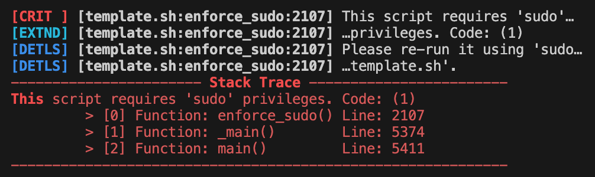
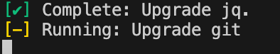

<!-- omit in toc -->
# Bash Template Functions

These functions provide basic setup and utilities for the template, such as:

* **[Basic Template Functions](#basic-template-functions):** Fundamental functions that I use for any script are second in importance only to the shebang.
* **[Error Tracing](#error-tracing):** Critical error tracing and debugging tools that we hope the user will never see but are there to provide information if * we need it.
* **[Print/Display Environment Functions](#printdisplay-environment-functions):** Helper functions, showing functionality and providing some debugging * information in the logs.
* **[Check/Validate Environment Functions](#checkvalidate-environment-functions):** These ensure hte environment is appropriate for the script (and vice * versa.)
* **[Text and Logging Functions](#text-and-logging-functions):** A feature-packed logging engine for Bash scripting.
* **[Helper Functions](#helper-functions):** Those functions you always use to save yourself some typing.
* **[Get Project Parameters Functions](#get-project-parameters-functions):** These are used inside a Git repo to understand the project specifics.
* **[Git Functions](#git-functions):** These are used to pull down files directories or clone an entire repo.
* **[Menu Functions](#menu-functions):** A configurable/extensible menu engine that makes it simpler to provide user choices in a Bash script.
* **[Arguments Functions](#arguments-functions):** A configurable/extensible arguments parsing engine for all Bash scripting needs.

A complete listing and usage information is below.

<!-- omit in toc -->
## Table of Contents
- [Basic Template Functions](#basic-template-functions)
- [Error Tracing](#error-tracing)
- [Print/Display Environment Functions](#printdisplay-environment-functions)
- [Check/Validate Environment Functions](#checkvalidate-environment-functions)
- [Text and Logging Functions](#text-and-logging-functions)
- [Helper Functions](#helper-functions)
- [Get Project Parameters Functions](#get-project-parameters-functions)
- [Git Functions](#git-functions)
- [Common Script Functions](#common-script-functions)
- [Menu Functions](#menu-functions)
- [Arguments Functions](#arguments-functions)
- [Main Functions](#main-functions)

## Basic Template Functions

These would be common in nearly any script as a starting point.

* `trap_error()` - Optionally uncomment the `trap 'trap_error "$LINENO"' ERR` line to have this function capture all errors. This should only be used during initial development, if at all, and certainly not for production use. In everyday use, `warn()` and `die()` are preferred as they produce consistent output for troubleshooting.
* `egress()` - This is set up as a trap for exiting the script; it will be the last function executed regardless of how the script exits (e.g., with `exit.`)
* **Debug** - These are stripped-down, feature-toggled logging functions for the script developer. The days of dropping in `echo "I made it here."` and then forgetting to remove it again is over. These four functions are self-contained and will help you debug the rest of your work, and turning them off is as simple as not using "debug" as an argument when you call the script.
    * `debug_start()` - Called as the first line of a function or main script block with `local debug=$(start_debug "$@"); eval set -- "$(debug_filter "$@")"`. This will capture the "debug" argument and allow using it for `debug_print()`, `debug_end()` and other similar feature-toggled functions or blocks. It will strip the argument "debug" out of the argument list, so no additional consideration for the argument is needed. It will log the start of the function and the calling line and function.
    * `debug_filter()` - This function is used by `debug_start()` to clean the argument from the argument list.
    * `debug_print()` - Used within a function to debug print information. This is feature-toggled and will only print if `$debug` is passed as the last argument, and `$debug=="debug"`.
    * `debug_end()`- Provides a last line of the function marker in the debug log, used to show when control is passed back to the calling function.

## Error Tracing

* `stack_trace()` - Called by die() and optionally by warn() (or may be called directly whenever needed); this shows the call stack of the executing script (see `die()`.)
* `warn()` - Prints a configurable warning, optional code, and an optional stack trace. 
* `die()` - Prints a critical error and ends the script immediately with a stack trace. If `egress()` is used, it will execute that function if it can. Here is an example of executing die() for a critical error, which leverages ANSII color codes, `wrap_messages()`, and `stack_trace()`.
 

## Print/Display Environment Functions

  * `print_system()` - Prints system information, e.g.: `[INFO ] System: Debian GNU/Linux 12 (bookworm).`
  * `print_version()` - Prints script version, e.g.: `[INFO ] Running Bash Template's 'template.sh', version 1.2.0-main+1.aea9b15-dirty`

## Check/Validate Environment Functions

  * `determine_execution_context()` - This is the function called by `handle_execution_context()`. The handler makes it easier to use, but you may find some use in calling it directly. It will return one of:
 *`0`: Script executed via a pipe.
 *`1`: Script executed with `bash` unusually.
 *`2`: Script executed directly (local or from PATH).
 *`3`: Script executed from within a GitHub repository.
 *`4`: Script executed from a PATH location.
  * `handle_execution_context()` - The handler for `determine_execution_context()`, this will set:
      * `THIS_SCRIPT` - The script's detected name will be "piped_script" if the script was cat/curled and piped through bash.
      * `USE_LOCAL` - The script is "local" instead of being curled in.
      * `IS_REPO` - The script is running in a Git repo.
      * `IS_PATH` - The script was executed from one of the available system paths.
  * `enforce_sudo()` - If `REQUIRE_SUDO` is true, this will ensure the script was invoked with sudo (not running logged in as root.)  It will throw an error and exit the script if `REQUIRE_SUDO` and the script is not invoked with it.
  * `validate_depends()` - Iterates through `DEPENDENCIES` and ensures they are all present. Will `warn()` on any individual missing dependencies and `die()` at the end if the number missing is > 0.
  * `validate_sys_accs()` - Iterates through `SYSTEM_READS` and ensures all critical information paths are available and accessible to the user. Exits the script if not met.
  * `validate_env_vars()` - Iterates through `ENV_VARS` and ensures all expected environment variables are available. Exits the script if not met.
  * `check_bash()` - Ensure we run in a Bash shell. Exits the script if not met.
  * `check_sh_ver()` - Checks the bash version against `MIN_BASH_VERSION` and enforces the required level.
  * `check_bitness()` - Will enforce the system against the requirements set by `SUPPORTED_BITNESS`. Exits the script if not met.
  * `check_release()` - Validates the information in `/etc/os-release` against `MIN_OS` and `MAX_OS` requirements. Exits the script if not met.
  * `check_arch()` - This may be the only Raspberry Pi-specific check. I decided to restrict the usage of certain boards in my projects. This iterates `SUPPORTED_MODELS` and will enforce the supported/non-supported models. Exits the script if not met.
  * `validate_proxy()` - This is not used in the template but is made available to test Internet connectivity via a proxy either in `http_proxy`/`https_proxy` variables or sent as an argument.   It will subsequently call check_url() to validate the proxy.
  * `check_url()` - Attempts to connect to a URL with `curl` or `wget`, typically invoked via `check_internet()`.
  * `check_internet()` - Combines proxy validation and direct internet connectivity tests using `check_url`. Validates proxy configuration first then tests connectivity with and without proxies. Failure is indicated through `warn()`, and the function will return false.

## Text and Logging Functions

The wrapper functions `logD()` `logI()` `logW()` `logE()` `logC()` are the typical interface points for these functions.

* `print_log_entry()` - The part of the logging engine that pulls it together and logs the message.
* `prepare_log_context()` - Creates the timestamp and line number information used in the log-to-file portion.
* `log_message()` - Assembles incoming information, combines it with the log contest, and sends it to `print_log_entry()`. 
* `log_message_with_severity()` - Receives a log request from the helper/wrapper functions below, assigns and validates severity, and handles overflow text.
    * `logD()` - Log a message as level `DEBUG`.
    * `logI()` - Log a message as level `INFO`.
    * `logW()` - Log a message as level `WARNING`.
    * `logE()` - Log a message as level `ERROR`.
    * `logC()` - Log a message as level `CRITICAL`.
    * `logX()` - Log a message as level `EXTENDED`.
* `init_log()` - Handles initial log file setup and validation
* `default_color()` - Safely creates ANSI sequences for text colors, defaulting to "" if ANSI support is undetected.
* `init_colors()` - Makes all ANSI sequences available globally.
* `generate_separator()` Create a separator line for display, which may either be "heavy" (a string of "===") or light (a string of "---"). The current COLUMNS environment variable will determine the width, or 80 characters, if COLUMNS is unavailable.
* `validate_log_level()` - This function, called by `setup_log()`, checks whether the current LOG_LEVEL is valid. If LOG_LEVEL is not defined in the `LOG_PROPERTIES` associative array, it defaults to "INFO" and displays a warning message.
* `setup_log()` - Handles enabling the logging engine, called in the initial script setup in `_main()`.
* `toggle_console_log()` - Used to temporarily turn the console logging off (if enabled) and restore it to its original state.
* `pad_with_spaces()` - Pads a number with spaces to display as a string of X characters for alignment. It defaults to 4; optionally, supply a different number for different padding.
* `wrap_messages()` - Wraps any log* messages at the current column width or 80 characters if COLUMNS is not set.

## Helper Functions

  * `add_dot()` - Adds a preceding dot if one is not present for text or path manipulation.
  * `remove_dot()` - Removes any preceding dot; for text or path manipulation.
  * `add_period()` - Adds a trailing period if one is not present for text or path manipulation.
  * `remove_period()` - Removes any trailing period; for text or path manipulation.
  * `add_slash()` - Adds a trailing slash if one is not present for path manipulation.
  * `remove_slash()` - Removes trailing slash if one is not present for path manipulation.
  * `pause()` - Pauses and waits for user input.

## Get Project Parameters Functions

These will all refresh the Global Dynamic Declarations if you run in a local repository.

* `get_repo_org()` - Determines the git repo org (typically the owner's name) from the repo if available.
* `get_repo_name()` - Determines the repo's name from the repo if available.
* `repo_to_title_case()` - For display purposes, converts "bash-template" to "Bash Template."
* `get_repo_branch()` - Get the current Git branch in the local repo.
* `get_last_tag()` - Get the last tag in the local repo.
* `is_sem_ver()` - Determines if a given tag passed via argument is a valid semantic version.
* `get_sem_ver()` - Builds a valid semantic version from the local repo.
* `get_num_commits()` - Get the number of commits since the last tag.
* `get_short_hash()` - Get the short hash of the current Git commit.
* `get_dirty()` - Returns true if there are uncommitted changes in the local repo.
* `get_proj_params()` - This is the entry point for updating the Global Dynamic Declarations if you work from within a local Git repo. These will all default to those provided in the header declarations if unavailable.

## Git Functions

These interact with a Git repo intended to pull files or an entire repository for an installation, for example.

* `download_file()` - Given a file path and destination path, this will download a file from the current GitHub branch. Generally called by `download_files_in_directories()`.
* `git_clone()` - Will clone a GotHub repo using the global GitHub variables.
* `fetch_tree()` - Uses the `jq` package to fetch the Git tree of a specified branch from a repository. Generally called by `download_files_in_directories()`.
* `download_files_in_directories()` - Will use the global `GIT_DIRS` and `USER_HOME` information to download a list of directories from a GitHub repo to `$USER_HOME/$REPO_NAME`. A typical use case would be to grab all man files, web files, or application files without cloning the entire repo.

## Common Script Functions

These building blocks are intended to facilitate the developer's template use.

* `start_script()` - A fundamental entry point for user interaction. This would be executed after the script validates the environment and handles dependencies. This will pause for a user's input to begin the rest of the script. It will not wait if `TERSE` is true, and it will time out and continue if there is no input for 10 seconds. This is intended for you to build upon as needed.
* `set_time()` - This is a Ubuntu/Debian-specific function. The default timezones are UTC for these distros (including the Raspberry Pi, for which I often work on projects). Since many of my projects rely on local time awareness, this will detect if the timezone is UTC/GMT/BST, the defaults for Ubuntu, Debian, and Raspberry Pi systems. If the system is set to one of these and the script is not in TERSE mode, it will prompt the user to change time via the `dpkg-reconfigure tzdata` command. If in TERSE or the system is not UTC/GMT/BST, the script will log INFO or WARN and continue.
* `exec_new_shell()` - Used to execute a new script or program in a new shell and exit the current script.
* `exec_command()` - A wrapper for any command used during script execution. It will display a yellow [-] indicator while running, a green [✔] when complete and successful, or a red [✘] if not successful:
 
* `handle_apt_packages()` - Will refresh the apt-cache (`apt-get update`), install a list of apt packages in `APT_PACKAGES`, or upgrade them if they are installed and an upgrade is available.
* `finish_script()` - Like start_script(), this is a fundamental exit point for user interaction. As implemented, this will be executed after the script is complete. You should build upon this as needed to provide final instructions or other information.
* `exit_script()` - This function handles script exit operations by logging the exit message along with the status code, function name, and line number where the exit occurred. The function also supports an optional message and exit status. This is cleaner than simply using `exit` in your code, as you will have some information about where it was called. It defaults to error level 0, but a different level may be used.

## Menu Functions

Creating a user-interactive menu system for a bash script is one of our most common but tedious tasks. The menu functions here are written to allow you to quickly and easily create a multi-level menu system for user interaction. The script execution here is straightforward, if not surprisingly versatile, and you should examine these, starting with `do_menu() `for your own needs.

* `option_one()` - Example function called by menu
* `option_two()` - Example function called by menu
* `option_three()` - Example function called by menu
* `display_main_menu()` - Example main menu
* `display_sub_menu()` - Example sub menu
* `display_menu()` - Called by a menu function (main, sub, whatever) to handle the iteration, display, and response capture. 
* `do_menu()` - Loop to display a menu `display_main_menu()` by default, the arguments for which would be the menu arrays (e.g., `MAIN_MENU[@]`)

## Arguments Functions

Alongside an interactive menu, handling command line arguments is a developer's most common yet frustrating task. The arguments functions here are written to allow you to quickly and easily create a versatile argument-handling system for your needs. Even something as basic as keeping usage instructions in line with command line arguments is frustrating and often overlooked - these functions will handle that for you.

The script execution here is straightforward and versatile, and you should examine these, starting with `process_args() `for your own needs.

  * `ARGUMENTS_LIST`
    * `word_arg_one()`
    * `word_arg_two()`
  * `OPTIONS_LIST`
    * `flag_arg_one()`
    * `flag_arg_two()`
    * `flag_arg_tre()`
    * `flag_arg_fwr()`
  * `process_args()`
  * `usage()`

## Main Functions

While developing this template, I noticed a strange "feature" of bash: it does not know the difference between `main()` and the script body. To provide relevant debugging information as needed, I needed to adopt what may look like a tortured paradigm to wrestle with this particular eccentricity:

``` bash
_main() {
  # Do stuff here
}
main() { _main "$@"; return "$?"; }
main "$@" "$debug"
exit $?
```

* `main()` - This is a small function that does nothing but pass all arguments to `_main().` While both script body commands and `main()` will show as `main()` when examining `FUNCTION,` using the minimum possible number of commands in the function called `main()` should reduce your hair-pulling and debugging quirks.
* `_main()` - This is the function formerly known as `main()`.  You will do your main program logic here.
