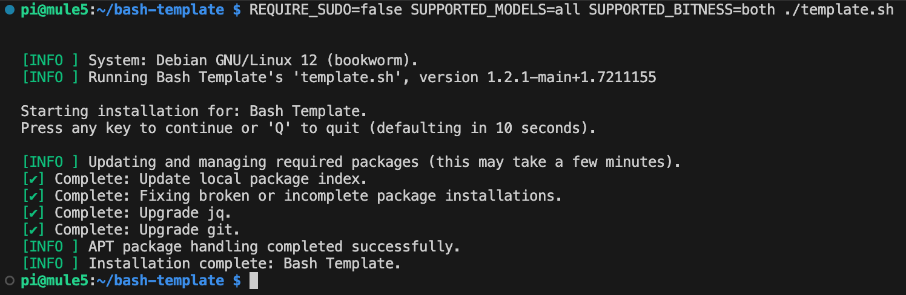

<!-- omit in toc -->
# Bash Script Template Documentation

<!-- omit in toc -->
## Table of Contents
- [Feature Overview](#feature-overview)
- [Usage and Customization](#usage-and-customization)
  - [Global Declarations](#global-declarations)
  - [Functions](#functions)
- [Documentation Style](#documentation-style)
- [Debugging](#debugging)
  - [Debugging Example](#debugging-example)
- [Exemplar Function](#exemplar-function)

## Feature Overview
This Bash script serves as a comprehensive template for various Bash scripting projects. It provides advanced functionality for managing installation processes, logging, error handling, and system validation. Key features include:

* Git Functions
  * Contextual knowledge of local Git environment: Organization, Repo Name, Branch, Tags, Dirty flags
  * Parse repo and Download individual files from Git
  * Parse repo and download directories from Git
  * Clone Git repositories
  * Semantic version development
* Apt Package management
  * Cache and install package updates
  * Install list of required packages
* Environment validation
  * Enforce Shell type
  * Enforce Bash version
  * Enforce System tools
  * Enforce sudo use
  * Enforce Bitness
  * Enforce architecture (Raspberry Pi model validation)
  * Validate Internet access (including proxy support)
* Execution context information
  * Script name
  * Is running locally (vs. pipe from the Internet)
  * Is running in a Git repo
  * Is running from the system path
* Debugging capabilities, feature flagged (no need to remove when done) independent of operational logging
* warn() and die() error trapping with optional stack tracing
* Full operational logging to file or screen
  * Customizable levels: Debug, Info, Warning, Error, Critical, Details and Extended
  * Colorized
  * Word wrapping support
* Executes a command and capture execution (status indicator, checkmark for done, X for failed), colorized
* Can execute a new shell (another script) and transfer command
* Colorized text options
* Extensible user menu
* Extensible command line options with adaptable usage display

As it sits, this script does nothing useful besides installing apt packages.  Running with some environmental overrides to change configured behavior, this is what a successful execution looks like:



It's up to you to make this useful for your needs.

## Usage and Customization

To use this template:

1. Customize the placeholders (declarations) with your script-specific logic.
2. Follow the provided function and variable documentation style.

### Global Declarations

You can modify the script's functionality and function by using the global declarations at the beginning of the script. While some scripts have three lines up top with some minor changes you can make, this, being more extensible, requires a little scrolling.

Most of these will use environment values or allow default if the environment does not have this setting: `DRY_RUN=" ${DRY_RUN:-false}" ` means if you set DRY_RUN in the environment (or use `DRY_RUN=true scriptname.sh` to execute), it will default to that value. If the environment does not have this variable set, it will take whatever is to the right of the hyphen (`-`) as its default value.

Details about the global declarations and how you may use them to modify the script's behavior may be found in [Declarations](Declarations.md).

### Functions

An accounting of the functions in the script and what each does may be found in [Functions](Functions.md).

## Documentation Style

This script adheres to Doxygen-style documentation. While I've tried to make this README comprehensive, you must delve into the script at some point. There are way more comment lines than script lines. For fun, I wrote a little script (of course!) to find that out:

``` bash
#!/bin/bash

# Check if a file is provided as an argument
if [ $# -ne 1 ]; then
    echo "Usage: $0 <script.sh>"
    exit 1
fi

# File to be analyzed
file="$1"

# Total lines in the file (including empty and comment lines)
total_lines=$(wc -l < "$file")

# Count actual lines (non-empty and not comments)
real_lines=$(grep -v '^\s*#' "$file" | grep -v '^\s*$' | wc -l)

# Count comment lines (lines that start with #)
comment_lines=$(grep '^\s*#' "$file" | wc -l)

# Count whitespace lines (empty or only whitespace)
whitespace_lines=$(grep '^\s*$' "$file" | wc -l)

# Calculate percentages with one decimal place
real_percentage=$(awk "BEGIN {printf \"%.1f\", ($real_lines/$total_lines)*100}")
comment_percentage=$(awk "BEGIN {printf \"%.1f\", ($comment_lines/$total_lines)*100}")
whitespace_percentage=$(awk "BEGIN {printf \"%.1f\", ($whitespace_lines/$total_lines)*100}")

# Output the results
echo "* Total lines: $total_lines"
echo "* Real lines: $real_lines ($real_percentage%)"
echo "* Comment lines: $comment_lines ($comment_percentage%)"
echo "* Whitespace lines: $whitespace_lines ($whitespace_percentage%)"
```

The results:

* Total lines: 5418
* Real lines: 2330 (43.0%)
* Comment lines: 2485 (45.9%)
* Whitespace lines: 603 (11.1%)

We've established that I may not love, but I embrace comments and documentation. Here's an example of the comments I've tried to provide everywhere:

``` bash
# -----------------------------------------------------------------------------
# @brief Brief description of the function's purpose.
# @details Detailed explanation, including context and operation.
#
# @param $1 Description of the first parameter.
# @param $2 Description of the second parameter.
# ...
#
# @global GLOBAL_VAR_NAME Description of global variable usage.
# ...
#
# @throws Description of errors the function may produce.
#
# @return Description of the return value or behavior.
#
# @example
# Example usage of the function with expected output or behavior.
# -----------------------------------------------------------------------------
```

## Debugging
You may enable debugging by passing a `debug` flag to the entire script execution or individual functions. When enabled, debug messages are printed to `stderr` to avoid conflicting with functions that need to return text or numbers to the calling script. Debugging output is completely feature-flagged and intended to allow you to develop information without needing to go back and delete it afterward. It functions independently of the regular logging system.

### Debugging Example
``` bash
local debug=$(debug_start "$@"); eval set -- "$(debug_filter "$@")"

debug_print "This is a message" "$debug"
```

The initial debug line handles passing "debug, " capturing it in the `$debug` variable, and stripping it from the other arguments passed to the function. No other consideration for this argument needs to be made; e.g., your `$1` is still `$1`.

The `$debug` argument is passed to all subsequent functions (and your new functions should be added as such). If you pass it to the script, e.g., `./template "debug"`, you will see the debug output of every function called like this:

```
pi@pi:~/bash-template $ sudo ./template.sh "debug"
[DEBUG] Function 'main()' called by 'main()' at line 4010.
[DEBUG] Function 'handle_execution_context()' called by 'main()' at line 3969.
[DEBUG] Function 'determine_execution_context()' called by 'handle_execution_context()' at line 1278.
[DEBUG] Determining script execution context.
[DEBUG] Resolved script path: /home/pi/bash-template/template.sh.
[DEBUG] GitHub repository detected at depth 0: /home/pi/bash-template.
[DEBUG] Execution context: Script is within a GitHub repository.
[DEBUG] Function 'get_proj_params()' called by 'main()' at line 3970.
[DEBUG] Configuring local mode with GitHub repository context.
[DEBUG] THIS_SCRIPT set to: template.sh
[DEBUG] Function 'get_repo_org()' called by 'get_proj_params()' at line 3310.
[DEBUG] Retrieved organization from local Git remote URL: lbussy
[DEBUG] Exiting function' get_repo_org()'.
[DEBUG] REPO_ORG set to: lbussy
[DEBUG] Function 'get_repo_name()' called by 'get_proj_params()' at line 3313.
[DEBUG] Exiting function 'get_repo_name()'.
[DEBUG] REPO_NAME set to: bash-template
[DEBUG] Function 'get_git_branch()' called by 'get_proj_params()' at line 3316.
[DEBUG] Exiting function 'get_git_branch().'
[DEBUG] GIT_BRCH set to: main
[DEBUG] Function 'get_last_tag()' called by 'get_proj_params()' at line 3319.
[DEBUG] Retrieved tag from Git: 1.0.0
[DEBUG] Exiting function' get_last_tag()'.
[DEBUG] GIT_TAG set to: 1.0.0
[DEBUG] Function 'get_sem_ver()' called by 'get_proj_params()' at line 3322.
[DEBUG] Function 'get_last_tag()' called by 'get_sem_ver()' at line 3228.
[DEBUG] Retrieved tag from Git: 1.0.0
[DEBUG] Exiting function' get_last_tag()'.
[DEBUG] Received tag: from get_last_tag().
[DEBUG] Function 'get_git_branch()' called by 'get_sem_ver()' at line 3238.
[DEBUG] Exiting function 'get_git_branch().'
[DEBUG] Appended branch name to version: main
[DEBUG] Function 'get_num_commits()' called by 'get_sem_ver()' at line 3243.
[DEBUG] Exiting function 'get_num_commits().'
[DEBUG] Function 'get_short_hash()' called by 'get_sem_ver()' at line 3250.
[DEBUG] Short hash of the current commit: 2726605
[DEBUG] Exiting function' get_short_hash()'.
[DEBUG] Appended short hash to version: 2726605
[DEBUG] Function 'get_dirty()' called by 'get_sem_ver()' at line 3255.
[DEBUG] Changes detected..
[DEBUG] Exiting function' get_dirty()'.
[DEBUG] Repository is dirty. Appended '-dirty' to version.
[DEBUG] Exiting function' get_sem_ver()', SEM_VER is 1.0.0-main.2726605-dirty.
[DEBUG] SEM_VER set to: 1.0.0-main.2726605-dirty
[DEBUG] LOCAL_SOURCE_DIR set to: /home/pi/bash-template
[DEBUG] LOCAL_WWW_DIR set to: /home/pi/bash-template/data
[DEBUG] LOCAL_SCRIPTS_DIR set to: /home/pi/bash-template/scripts
[DEBUG] Exiting function' get_proj_params()'.
[DEBUG] Function 'parse_args()' called by 'main()' at line 3971.
[ERROR] Unknown option: debug
[DEBUG] Function 'usage()' called by 'parse_args()' at line 3908.
pi@pi:~/bash-template $
```

## Exemplar Function

This example shows how a function can receive an optional "debug" argument to enable debug printing:

``` bash
one_arg() {
    # Debug declarations
    local debug=$(debug_start "$@"); eval set -- "$(debug_filter "$@")"

    # Do stuff
    # ...
    local var="foo"
    debug_print "This is a conditional debug print that says $foo." "$debug"

    # Debug log: function exit
    end_debug "$debug"
}
